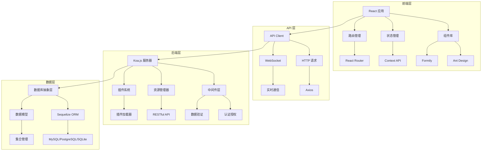
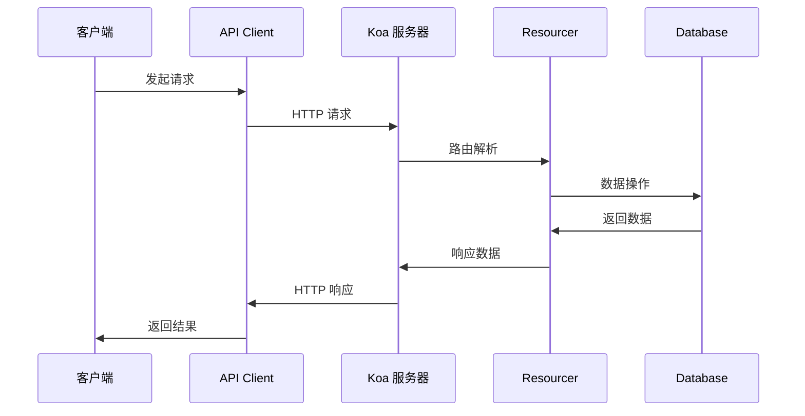
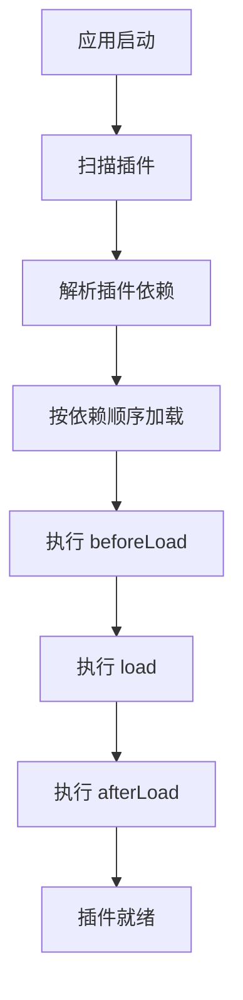

# NocoBase 架构设计

## 整体架构

NocoBase 采用现代化的前后端分离架构，基于插件化设计理念，提供高度可扩展的无代码开发平台。



## 核心概念

### 1. 插件化架构

NocoBase 的所有功能都通过插件实现，包括核心功能也是以插件的形式存在。

#### 插件类型
- **核心插件**: 提供基础功能的插件
- **业务插件**: 实现具体业务逻辑的插件
- **UI 插件**: 提供用户界面组件的插件
- **第三方插件**: 社区开发的扩展插件

#### 插件生命周期
```typescript
export class Plugin {
  async beforeLoad() {
    // 插件加载前的准备工作
  }
  
  async load() {
    // 插件主要逻辑加载
  }
  
  async afterLoad() {
    // 插件加载后的处理
  }
  
  async beforeEnable() {
    // 插件启用前的准备
  }
  
  async afterEnable() {
    // 插件启用后的处理
  }
  
  async beforeDisable() {
    // 插件禁用前的清理
  }
  
  async afterDisable() {
    // 插件禁用后的处理
  }
}
```

### 2. 资源管理器 (Resourcer)

资源管理器是 NocoBase 的核心组件，负责处理 RESTful API 请求。

#### 资源定义
```typescript
// 定义资源
app.resourcer.define({
  name: 'posts',
  actions: {
    list: async (ctx, next) => {
      // 获取列表数据
      ctx.body = await ctx.db.getRepository('posts').find();
      await next();
    },
    get: async (ctx, next) => {
      // 获取单个资源
      const { filterByTk } = ctx.action.params;
      ctx.body = await ctx.db.getRepository('posts').findOne({
        filterByTk,
      });
      await next();
    },
    create: async (ctx, next) => {
      // 创建资源
      const { values } = ctx.action.params;
      ctx.body = await ctx.db.getRepository('posts').create({
        values,
      });
      await next();
    },
    update: async (ctx, next) => {
      // 更新资源
      const { filterByTk, values } = ctx.action.params;
      ctx.body = await ctx.db.getRepository('posts').update({
        filterByTk,
        values,
      });
      await next();
    },
    destroy: async (ctx, next) => {
      // 删除资源
      const { filterByTk } = ctx.action.params;
      await ctx.db.getRepository('posts').destroy({
        filterByTk,
      });
      ctx.body = 'ok';
      await next();
    },
  },
});
```

#### API 路由规则
```
# 独立资源
GET    /api/posts          # 获取文章列表
POST   /api/posts          # 创建文章
GET    /api/posts/1        # 获取指定文章
PUT    /api/posts/1        # 更新指定文章
DELETE /api/posts/1        # 删除指定文章

# 关系资源
GET    /api/posts/1/comments    # 获取文章的评论列表
POST   /api/posts/1/comments    # 为文章创建评论
GET    /api/posts/1/comments/2  # 获取文章的指定评论
PUT    /api/posts/1/comments/2  # 更新文章的指定评论
DELETE /api/posts/1/comments/2  # 删除文章的指定评论
```

### 3. 数据模型

NocoBase 使用集合 (Collection) 的概念来管理数据模型。

#### 集合定义
```typescript
// 定义集合
db.collection({
  name: 'posts',
  fields: [
    {
      type: 'string',
      name: 'title',
      allowNull: false,
    },
    {
      type: 'text',
      name: 'content',
    },
    {
      type: 'belongsTo',
      name: 'user',
      target: 'users',
    },
    {
      type: 'hasMany',
      name: 'comments',
      target: 'comments',
    },
  ],
});
```

#### 字段类型
- **基础类型**: string, text, integer, float, boolean, date, time, datetime
- **关系类型**: belongsTo, hasOne, hasMany, belongsToMany
- **特殊类型**: json, array, uuid, nanoid

### 4. 前端应用架构

#### 应用实例
```typescript
import { Application } from '@nocobase/client';

const app = new Application({
  apiClient: {
    baseURL: '/api/',
  },
  plugins: [
    // 插件列表
  ],
});
```

#### 组件系统
```typescript
// 注册组件
app.addComponents({
  MyComponent,
  AnotherComponent,
});

// 使用组件
<SchemaComponent schema={{
  type: 'void',
  'x-component': 'MyComponent',
  properties: {
    // 子组件配置
  },
}} />
```

## 数据流

### 1. 请求处理流程



### 2. 插件加载流程



## 安全架构

### 1. 认证系统

```typescript
// JWT 认证
app.use(async (ctx, next) => {
  const token = ctx.get('Authorization');
  if (token) {
    try {
      const user = jwt.verify(token, secret);
      ctx.state.currentUser = user;
    } catch (error) {
      ctx.throw(401, 'Invalid token');
    }
  }
  await next();
});
```

### 2. 访问控制 (ACL)

```typescript
// 定义权限
app.acl.define({
  role: 'user',
  resource: 'posts',
  actions: ['list', 'get'],
});

// 检查权限
app.acl.can({
  role: 'user',
  resource: 'posts',
  action: 'create',
});
```

## 性能优化

### 1. 数据库优化
- 使用连接池管理数据库连接
- 实现查询缓存机制
- 支持读写分离配置

### 2. 前端优化
- 组件懒加载
- 代码分割
- 静态资源缓存

### 3. API 优化
- 请求去重
- 响应缓存
- 分页查询

## 扩展性设计

### 1. 水平扩展
- 支持多实例部署
- 负载均衡配置
- 会话共享机制

### 2. 垂直扩展
- 插件热插拔
- 动态配置更新
- 资源动态注册

---

*本文档描述了 NocoBase 的核心架构设计，为开发者提供了深入理解系统的基础。*
